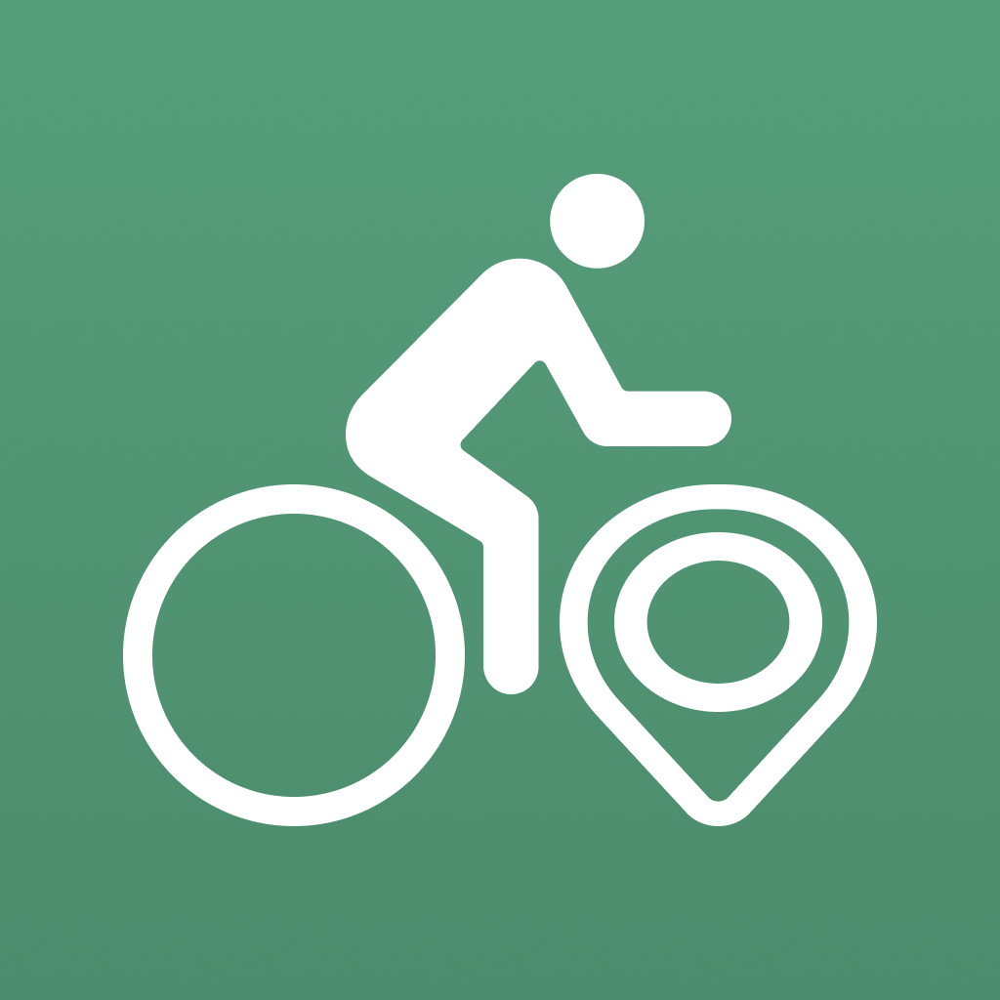

<p align="center">
   
   <p align="center" style="font-size:30px; font-weight:bold">Cycle Planner</p>
   <p align="center" style="padding-bottom:30px">A React Native application to plan your cycling route in Singapore.</p>
</p>

### Note!
Run the app in development build for maps to work.

### TODO - Features to be implemented
- After PCN route is generated, the UI for
   - Start Ride Navigation,
   - Save Route,
   - Clear,
   - Elevation,
   - ✅ Traffic Lights
- Route planner optimisation
- Profile page 
   - Saved Routes,
   - etc.
- Any other useful features

### DONE - Implemented Features
- ✅ Connect Nomatim or Photon Komoot API for start and destination search
- ✅ Logic for PCN route planning
- ✅ Icons for nav bar (normal, @2x, @3x)
- ✅ App icon (1024x1024)

### Built with
React Native (TypeScript), Expo, MapLibre, data.gov.sg

### Get started

1. Install dependencies

   ```bash
   npm install
   ```

2. Optional: Remove previously built Android or iOS app

   ```bash
   rm -rf android ios
   ```

3. Prebuild the app

   ```bash
   npx expo prebuild --clean
   ```

4. Run the app on either android or iOS

   ```bash
   npx expo run:android
   npx expo run:ios
   ```

In the output, you'll find options to open the app in a

- [development build](https://docs.expo.dev/develop/development-builds/introduction/)
- [Android emulator](https://docs.expo.dev/workflow/android-studio-emulator/)
- [iOS simulator](https://docs.expo.dev/workflow/ios-simulator/)
- [Expo Go](https://expo.dev/go), a limited sandbox for trying out app development with Expo

### Expo Docs

- [Expo documentation](https://docs.expo.dev/)
- [Expo guides](https://docs.expo.dev/guides)
